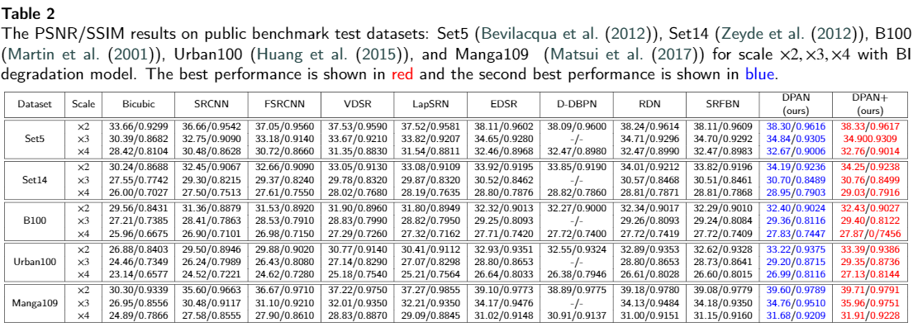
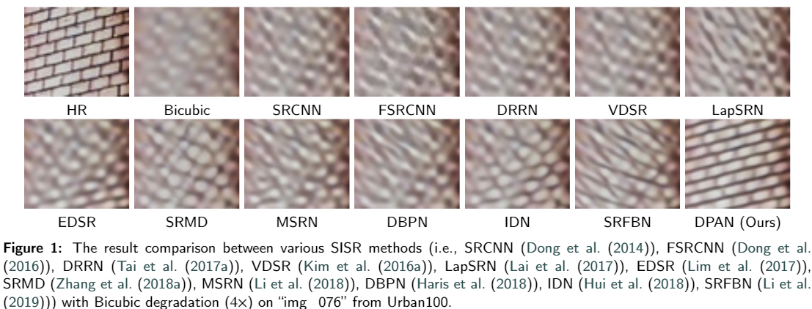

# Requirements
- python3
- skimage
- imageio
- pytorch == 1.1.0
- torchvisoin == 0.3.0
- matplotlib
- tqdm
- cv2 >= 3.xx

# Quickstart
We provide our trained models with Bicubic (BI) degradation for x2, x3, and x4.
We also provide test dataset Set5. You can specify the '--scale' in 'run' to 2, 3, or 4 and the '--pre_train' in 'run' to the corresponding trained models. 
Run the script and the results should be

| model | x2 | x3 | x4  |
| --- | --- | --- | --- |
|DPAN |38.30|34.84|32.67|

You can use '--save_results' to save the SR images.
# Prepare Data
###  Train
You can download training dataset [DIV2K or DF2K](https://github.com/Paper99/SRFBN_CVPR19).
###  Test
1. you can download SR benchmark (Set5, Set14, B100, Urban100 and Manga109) from the repository of [SRFBN](https://github.com/Paper99/SRFBN_CVPR19)

2. place all the HR images including both training and testing datasets in your directory.

3.  Specify  the 'args.dir_data' in 'option.py' to the directory you make

4. Run 'Prepare_TrainData_HR_LR_BI/BD/DN.m' in matlab to generate LR images for BI, BD, and DN models respectively.

# Begin to train
You can use scripts in file 'demo.sh' to train models for our paper.

`python main.py --gpu_id 0 --template DPAN --scale 2 --patch_size 96 --save DPAN_G10B10_BI_X2 `

or run `'sh demo.sh 0'`, where `'0'` is the --gpu_id.

# All Results

